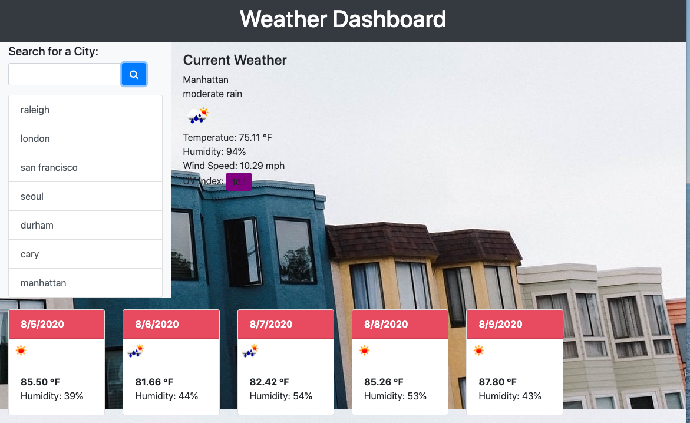

# WeatherDashboard
hw6

## Project Summary 

This project is designed to create an easy to use weather dashboard app to allow its user to find current weather conditions and a five day forecast by city. 

[Deployed on Github pages](https://jinhia.github.io/WeatherDashboard/)

 

## Features of Project

* User is able to search for multiple cities and will also display a search history so the user can choose a past citiy that was searched via local storage.
 
* This app uses OpenWeather API to retrieves its data.

* The app features a dynamically updated HTML and CSS using jQuery, 

* UV index is displayed and will change colors according to the UV scale. 

## Resources
*W3schools.com
*Stackoverflow.com
*Youtube.com
